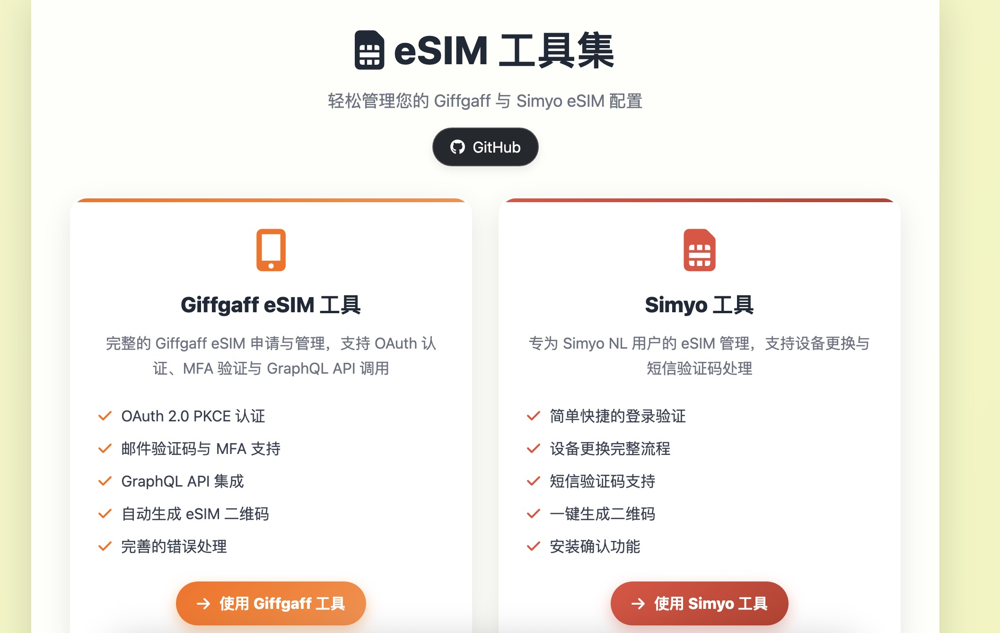
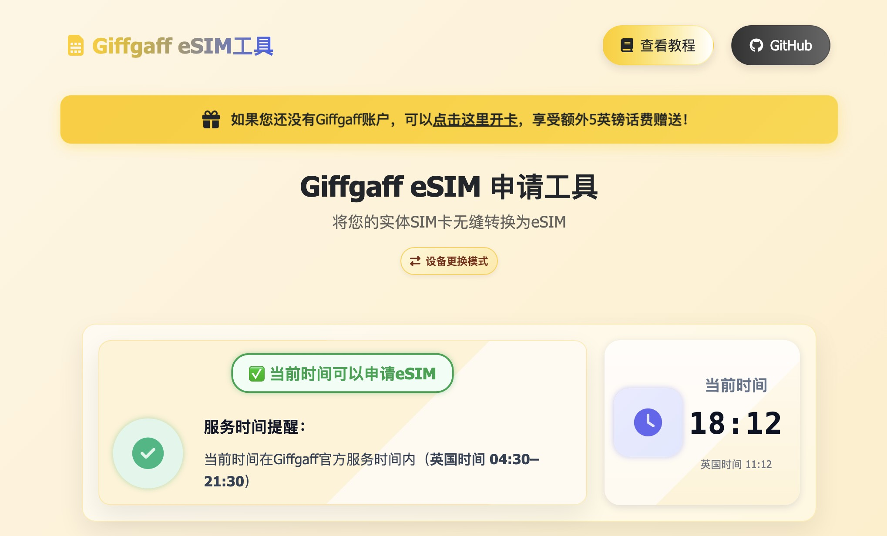
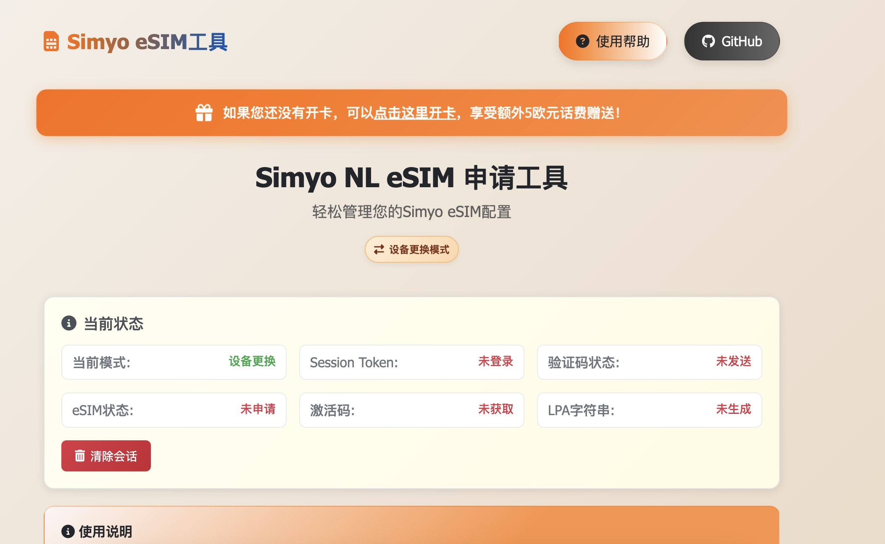

<div align="center">
<h1 align="center">eSIM Tools 🚀<br></img></h1>
</img>
<br>


<br>


<br>
</div>

专为Giffgaff和Simyo用户设计的现代化eSIM管理工具集，支持完整的eSIM申请、激活和二维码生成流程。

## ✨ 功能特性

### 🇬🇧 Giffgaff eSIM工具
- **OAuth 2.0 PKCE认证** - 安全的身份验证流程
- **智能Cookie登录** - 支持免OAuth快速登录
- **MFA多因子验证** - 邮件验证码支持
- **手动激活引导** - 安全的官方激活流程 [[memory:4907270]]
- **GraphQL API集成** - 完整的API调用链
- **LPA二维码生成** - 标准eSIM激活码

### 🇳🇱 Simyo eSIM工具
- **账户登录验证** - 荷兰手机号格式验证
- **设备更换支持** - 完整的SIM卡更换流程
- **短信验证码** - 自动发送和验证处理
- **即时二维码生成** - 一键生成可扫描激活码
- **安装确认** - 确保eSIM正确激活

## 🖼️ 界面预览

> 下方为主要页面的功能截图预览，便于快速了解工具界面与核心操作路径。

### 主页



### Giffgaff eSIM 工具



### Simyo eSIM 工具



## 🌐 在线使用

### 🚀 在线服务（推荐）
**完整功能版本**: [https://esim.cosr.eu.org](https://esim.cosr.eu.org)
- ✅ 无CORS限制，完整API功能
- ✅ 支持所有eSIM操作和流程
- ✅ 性能优化，支持离线使用
- ✅ 定期更新维护

### 🎁 新用户优惠
- **Simyo用户**: 新开卡享受[额外5欧元话费赠送](https://vriendendeal.simyo.nl/prepaid/AZzwPzb)
- **Giffgaff用户**: 新开卡享受[额外5英镑话费赠送](https://www.giffgaff.com/orders/affiliate/mowal44_1653194386268)

## 🚀 本地部署

### 快速开始

1. **克隆仓库**
   ```bash
   git clone https://github.com/Silentely/eSIM-Tools.git
   cd eSIM-Tools
   ```

2. **安装依赖**
   ```bash
   npm install
   ```

3. **启动代理服务器**
   ```bash
   # Windows
   start_simyo_server.bat
   
   # macOS/Linux
   ./start_simyo_server.sh
   
   # 或手动启动
   npm start
   ```

4. **访问应用**
   ```
   http://localhost:3000
   ```

### 环境要求
- **现代浏览器**: Chrome 88+, Firefox 85+, Safari 14+, Edge 88+
- **开发环境**: Node.js >= 18.0.0, npm >= 8.0.0 (仅本地开发需要)

## 🔧 技术架构

### 前端技术栈
- **HTML5/CSS3** - 响应式设计，现代化UI
- **JavaScript ES6+** - 模块化架构，现代语法特性
- **Bootstrap 5** - 响应式UI框架
- **Service Worker** - 离线支持和缓存优化

### 后端架构
- **生产环境**: Netlify Functions - 无服务器函数处理API代理
- **开发环境**: Node.js Express - 本地开发服务器
- **CORS处理** - 统一跨域请求解决方案
- **会话管理** - 安全的本地存储和自动过期机制

### 🚀 性能优化
- **资源压缩**: Webpack + TerserPlugin，压缩率65%+
- **Service Worker**: 离线缓存和网络状态监控
- **图片优化**: WebP格式支持，自动压缩
- **代码分割**: 自动分离第三方库，减少初始加载时间

> 详细性能优化说明请参考 [PERFORMANCE.md](./docs/PERFORMANCE.md)

### 服务时间说明
- **Giffgaff服务窗口**: 英国时间 04:30 – 21:30 (Europe/London)
- **窗口外操作**: 可能失败或不稳定，UI会显示本地时间与英国时间对比

## 📦 部署方式

### 🌟 推荐：在线服务
使用托管版本 [https://esim.cosr.eu.org](https://esim.cosr.eu.org)
- 无需部署配置，即开即用
- 自动更新，稳定可靠
- 完整功能支持

### 🔧 自建部署：Netlify
1. Fork此仓库到您的GitHub账户
2. 在[Netlify](https://app.netlify.com)中连接GitHub仓库
3. 构建设置：
   - Build command: `echo 'No build needed'`
   - Publish directory: `.`
4. 部署完成，获得您的专属域名

### ⚙️ 本地开发
```bash
# 克隆仓库
git clone https://github.com/Silentely/eSIM-Tools.git
cd eSIM-Tools

# 安装依赖并启动
npm install
npm start

# 访问 http://localhost:3000
```

## 📋 使用指南

### 🇬🇧 Giffgaff eSIM申请流程 [[memory:4907270]]
1. **身份验证** - OAuth登录或Cookie快速登录
2. **邮件验证** - 输入收到的MFA验证码
3. **申请eSIM** - 系统预留RESERVED状态的eSIM卡
4. **手动激活** - 访问 `https://www.giffgaff.com/activate`
   - 输入显示的 `activationCode`
   - 点击"Activate your SIM"
   - 确认"Yes, I want to replace my SIM"
5. **获取二维码** - 返回页面完成LPA激活码生成

> ⚠️ **重要提示**: 激活过程中请保持页面开启，避免会话过期

### 🇳🇱 Simyo eSIM申请流程
1. **账户登录** - 输入荷兰手机号(06开头)和密码
2. **选择服务** - 新申请或设备更换
3. **验证码处理** - 短信或客服验证码验证
4. **获取配置** - 系统生成eSIM配置信息
5. **扫码安装** - 使用生成的二维码在新设备上安装

### 📚 详细文档
- [Giffgaff详细说明](./docs/reference/README_giffgaff_esim.md)
- [Simyo详细说明](./docs/reference/README_simyo_esim.md)
- [性能优化指南](./docs/PERFORMANCE.md)

## ❓ 常见问题

### Giffgaff相关
**Q: 为什么需要手动激活？**
A: 出于安全合规考虑，eSIM激活需在官方页面完成。工具会展示激活码并提供详细引导。

**Q: 激活后多久能获得二维码？**
A: 通常数十秒至几分钟。完成手动激活后返回页面，系统自动生成LPA二维码。

**Q: 误关页面怎么办？**
A: 重新登录后系统会从可恢复节点继续。建议激活完成前保持页面开启。

### Simyo相关
**Q: 支持哪些手机号格式？**
A: 仅支持荷兰手机号（06开头的10位数字）。

**Q: 验证码收不到怎么办？**
A: 可选择客服验证码选项，或检查短信拦截设置。

## ⚠️ 重要说明

### 适用范围
- **Giffgaff**: 英国用户专用
- **Simyo**: 荷兰用户专用（06开头手机号）

### 安全与隐私
- ✅ 所有数据处理均在本地进行
- ✅ 不存储用户凭据信息
- ✅ 建议在安全网络环境下使用
- ✅ 开源透明，代码可审计

## 📁 项目结构

```
eSIM-Tools/
├── 📄 index.html                 # 主页面
├── 🖥️ server.js                  # 本地开发服务器
├── 📦 package.json               # 项目配置
├── 📂 src/                       # 源代码
│   ├── 🇬🇧 giffgaff/             # Giffgaff工具
│   ├── 🇳🇱 simyo/                # Simyo工具
│   ├── 🎨 styles/                # 样式文件
│   └── ⚙️ js/                    # JavaScript模块
├── 🌐 netlify/                   # 无服务器函数
│   └── functions/                # API代理
├── 📚 docs/                      # 项目文档
│   ├── guides/                   # 使用指南
│   ├── reference/                # 参考文档
│   └── fixes/                    # 问题修复
├── 🧪 tests/                     # 测试文件
└── 🛠️ scripts/                   # 部署脚本
```

### 跨域解决方案
1. **🌟 推荐**: 使用在线服务 [esim.cosr.eu.org](https://esim.cosr.eu.org)
2. **🔧 Netlify Functions**: 自动API代理
3. **💻 本地代理**: Node.js开发服务器
4. **📖 详细说明**: [CORS解决方案文档](./docs/guides/CORS_SOLUTION.md)

## 🧪 测试

项目包含完整的测试套件：
- **单元测试** - 核心函数和模块测试
- **集成测试** - API调用和流程测试
- **端到端测试** - 完整用户流程验证

```bash
# 运行测试套件
npm test

# 在浏览器中测试
open tests/test_giffgaff_esim.html
open tests/test_simyo_esim.html
```

## 🤝 贡献指南

欢迎贡献代码和提出建议！

### 参与方式
1. 🍴 Fork项目仓库
2. 🌿 创建功能分支 (`git checkout -b feature/AmazingFeature`)
3. 💾 提交更改 (`git commit -m 'Add AmazingFeature'`)
4. 📤 推送分支 (`git push origin feature/AmazingFeature`)
5. 🔃 创建Pull Request

### 开发规范
- 遵循现有代码风格
- 添加必要的测试用例
- 更新相关文档

## 📞 支持与反馈

遇到问题或有建议？
- 📋 [提交Issue](https://github.com/Silentely/eSIM-Tools/issues)
- 📖 查看[项目文档](./docs/)
- 💬 参与社区讨论

## 📄 许可证

- 本项目的所有代码除另有说明外,均按照 [MIT License](LICENSE) 发布。
- 本项目的README.MD，wiki等资源基于 [CC BY-NC-SA 4.0][CC-NC-SA-4.0] 这意味着你可以拷贝、并再发行本项目的内容，<br/>
  但是你将必须同样**提供原作者信息以及协议声明**。同时你也**不能将本项目用于商业用途**，按照我们狭义的理解<br/>
  (增加附属条款)，凡是**任何盈利的活动皆属于商业用途**。
- 请在遵守当地相关法律法规的前提下使用本项目。

## ⚖️ 免责声明
<p align="center">
  
</p>
本工具仅供学习和个人使用，请遵守相关服务条款。使用本工具产生的任何问题，开发者不承担责任。请在遵守当地法律法规的前提下使用。

[github-hosts]: https://raw.githubusercontent.com/racaljk/hosts/master/hosts "hosts on Github"
[CC-NC-SA-4.0]: https://creativecommons.org/licenses/by-nc-sa/4.0/deed.zh

<div align="center">
  <sub>Made with ❤️ by <a href="https://github.com/Silentely">Silentely</a></sub>
</div>
